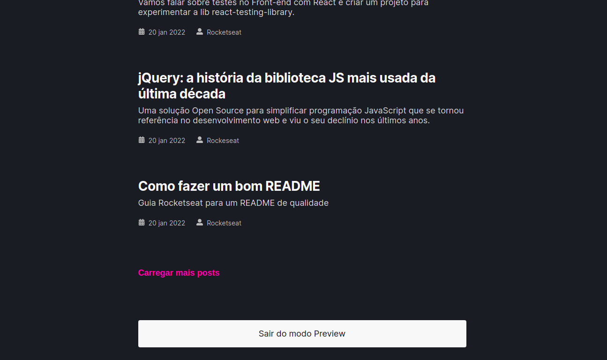

<h1 align="center">Spacetraveling</h1>

<p align="center">
  
  
  <a href="https://github.com/jtiagosantos/spacetraveling/commits/master">
    
  </a>
  
   <a href="https://github.com/jtiagosantos/spacetraveling/stargazers">
    
  </a>
</p>

<h4 align="center">
	🚧  spacetraveling 🤖 Completed 🚀 🚧
</h4>

<p align="center">
  <a href="#-features">Features</a> •
  <a href="#-run-project">Run Project</a> •
  <a href="#-technologies">Technologies</a> •
  <a href="#-layout">Layout</a> •
  <a href="#-author">Author</a> •
  <a href="#-license">License</a>
</p>

<br>

<h1 align="center">
    
</h1>

<h1 align="center">
    
</h1>

<hr />

## ⚙️ Features

- [x] Read posts
- [x] Load more posts

<hr>

## 🚀 Run Project

1️⃣ Clone project and access its folder:

```bash
$ git clone https://github.com/jtiagosantos/spacetraveling.git
$ cd spacetraveling
```

2️⃣ Install dependencies:

```bash
$ yarn ou npm i
```

3️⃣ Add environment variables:

```bash
#Prismic CMS
PRISMIC_API_ENDPOINT=xxxxxxxxxxxxxxxxx
```

4️⃣ Start project:

```bash
$ yarn dev ou npm run dev
```
<hr>

## 🛠 Technologies

The following tools were used in the construction of project:

- **[Next.js](https://nextjs.org/)**
- **[Typescript](https://www.typescriptlang.org/)**
- **[Sass](https://sass-lang.com/)**
- **[Prismic](https://prismic.io/)**
- **[Fetch](https://developer.mozilla.org/pt-BR/docs/Web/API/Fetch_API/Using_Fetch)**
- **[Date-fns](https://date-fns.org/docs/Getting-Started)**
- **[Jest](https://jestjs.io/)**

<hr>

## 🔖 Layout

You can view the project layout through the link below:

- **[Layout Web](https://www.figma.com/file/kd3TTvyo87gkxmlYfbMN3e/Desafios-M%C3%B3dulo-3-ReactJS-(Copy)?node-id=0%3A1)**

<hr>

## :cloud: Deploy

- **[Spacetraveling](https://spacetraveling-gilt.vercel.app/)**

<hr>

## 👨‍💻 Author


<strong><a href="https://github.com/jtiagosantos">Tiago Santos </a>🚀</strong>

[](https://www.linkedin.com/in/josetiagosantosdelima/)
[](mailto:tiago.santos@icomp.ufam.edu.br)

<hr>

## 📝 License

This project is under license [MIT](./LICENSE).
